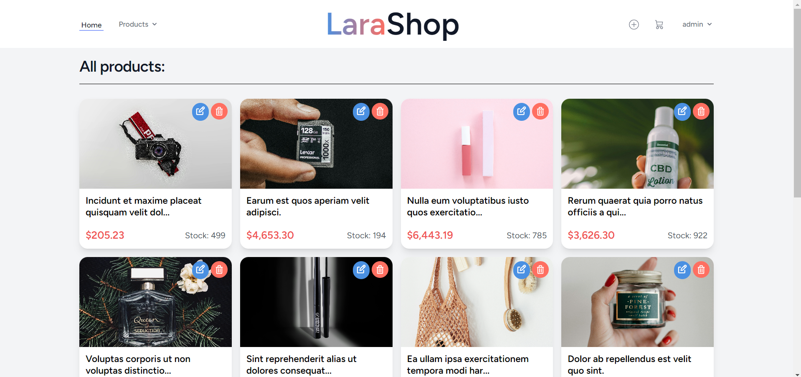
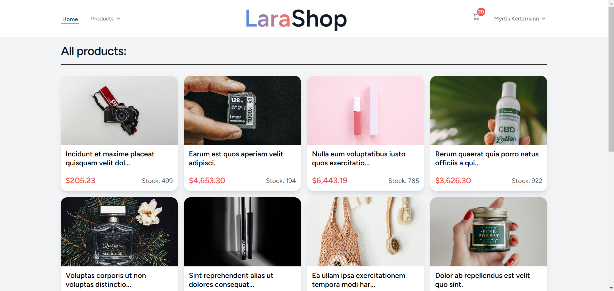

# Laravel E-commerce Project

 An e-commerce platform built with Laravel. This application is designed to provide a seamless and intuitive shopping experience, both for customers and administrators. 

## Features

### General
- **View all items**: Users can browse through all available products even without logging in.
- **Product details**: Detailed view of each product including images, description, and reviews.
- **Add to cart**: Users can add items to their cart whether logged in or not.
- **Sort by categories**: Products can be sorted based on categories for easy browsing.

### Admin
- **Add items**: Only administrators have the privilege to add new products.
- **Update/Delete items**: Administrators can update or delete existing products.

#### Screenshots

### User
- **Comment on products**: Only logged-in users who have purchased the product can leave a review.
- **View comments**: Comments with images and a summary of star ratings are visible to all users.
#### Screenshots

